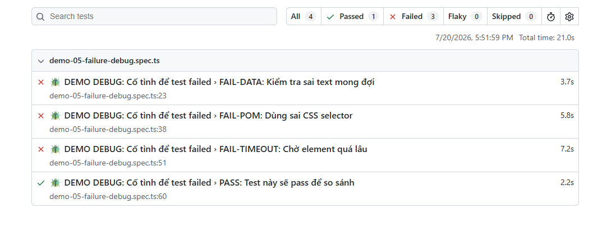
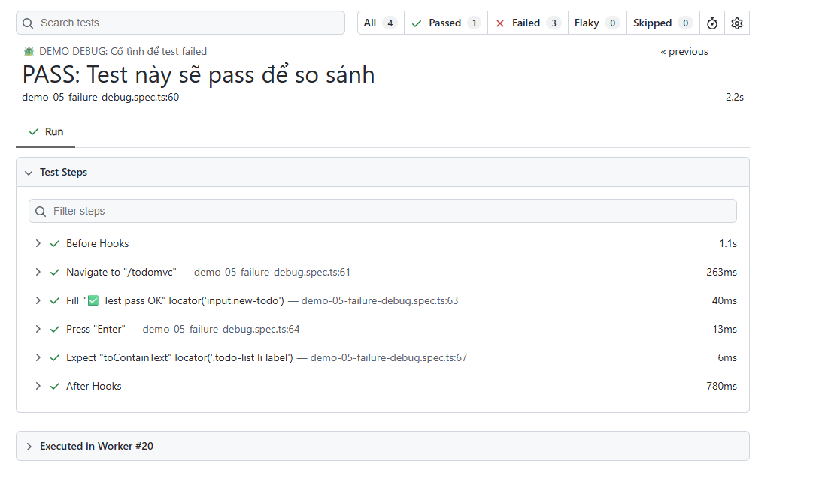
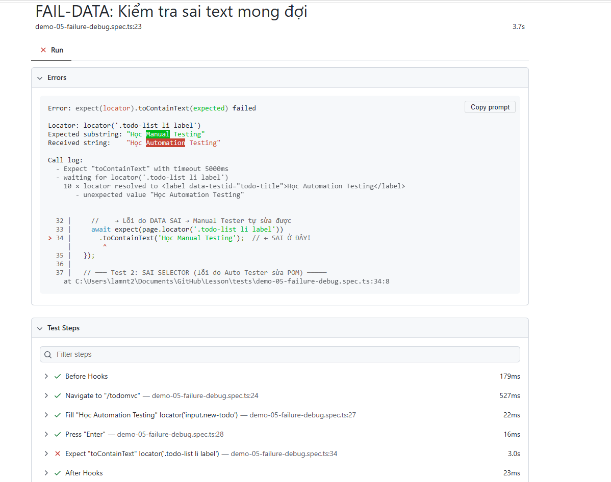
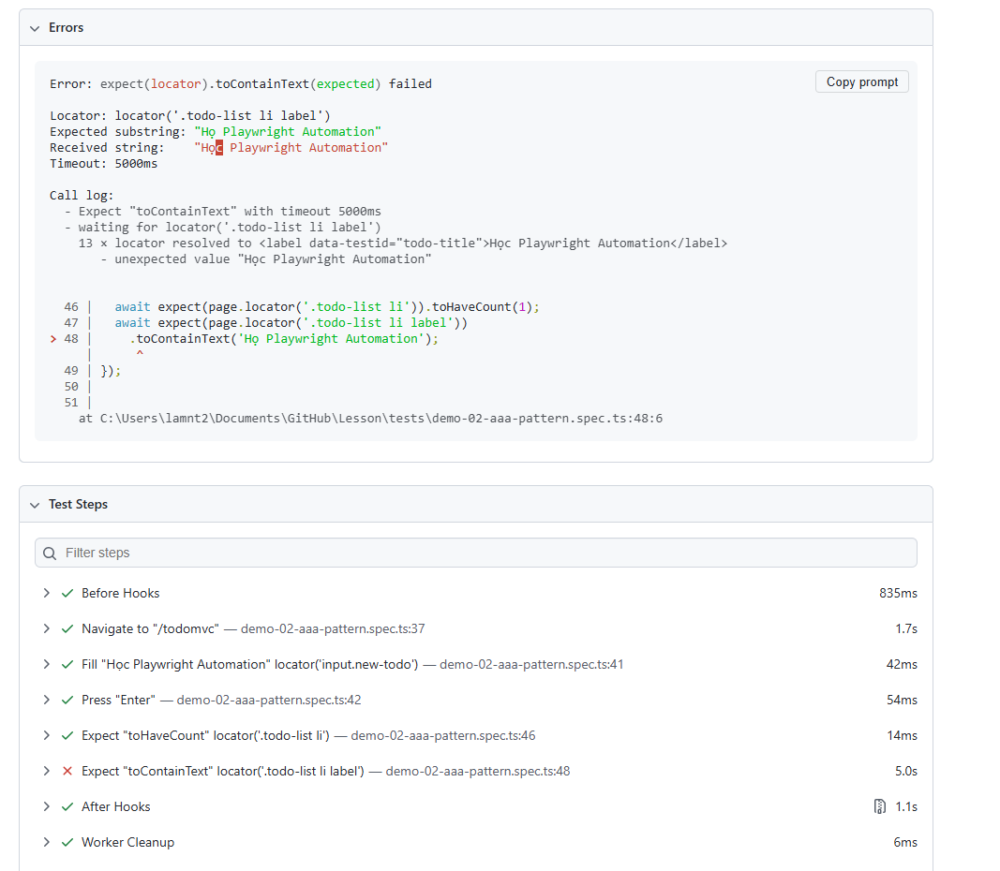

Bài 1
1. Các hàm thao tác cơ bản
2. 6 test
- Nhập text vào ô input > Enter > Tạo task thành công có nội dung giống với đã nhập (expected)
- Thêm task > Đánh dấu vào ô hoàn thành > Task đã được đánh dấu thành công (expected)
- Thêm task > Số lượng task là 1 (expected)
- Thêm task > Hover vào task > Ấn xóa > Số lượng task là 0 (expected)
- Vào page có dropdown > Click vào dropdrown > Chọn option 1 > Click vào dropdown > Chọn option 2 (expected)
- Vào page có checkbox > Tick vào checkbox 1 > Untick khỏi checkbox 1 (expected)

Bài 2
1. Ảnh tổng quan: 
2. Ảnh test passed: 
3. Ảnh test failed: 

Bài 3
1. tests\demo-02-aaa-pattern.spec.ts:34:5 › AAA-02: Điền form đăng ký và kiểm tra validation
2. 
3. Lỗi do data